---User Story

As a user, I want to... 
-view Magic: The Gathering (MTG) cards in the standard format 
-sort cards by normal MTG metrics (mana cost, card type, etc.) 
-create decks with standard-legal cards 
-edit those decks 
-delete decks 
-add comments to specific cards in the deck 
-have a page displaying my three favorite cards in the standard format 
-add comments to decks as a whole 

MTG Deckbuilder App v.1 
-Users can search for cards using different paramaters and see them on a results page 
-Users can add cards to their deck from the search results 
-Users can name their decks, edit the name, and delete decks 

MTG Deckbuilder App v.2 goals 
-Users will be able to add comments to their own decks and others 
-Users will be able to mark a card as a "Top Card" in the deck 
-Users will be able to remove and add cards from the deck edit page 
-Users will be able to see images of the cards on the search page (for Your Deck So Far section), on the deck show page, and the edit page 

---Known Issues v.1
-Delete buttons next to individual cards in deck edit page do not function
-Some cards in results do not have their image showing
    -These cards are likely the double-faced cards that have multiple images associated with them (their file structure in data returned from api call is slightly different from single-faced cards)
-Adding a mana value paramater to a search sometimes causes app to crash
    -Likely due to some of the double-faced cards not having a mana value, since they transform to their back face from the front (as such, the back-side is 'another' card which has no mana value)
-Edit page needs functionality to search cards and add to deck
-Image URLs of cards not saving from API call data to Card model in database
    -Images of cards should show up in search page (in 'Your current deck' section), deck show page, and deck edit page.
-App needs instructions to show users flow of deck creation (Go to Search cards -> add cards to deck from results (continue searching and adding until finished) -> hit Create Deck button in search page)
    -Considering changing structure of how pages are set up to allow for more intuitive flow
        -Add "New Deck" button to header that redirects users to search cards page with instructions on how to create their deck?
-Results page only shows first few results from api call
    -Api call in app should account for the "extra pages" when returned data from scryfall includes more than 75 items

---Wireframes

Home page
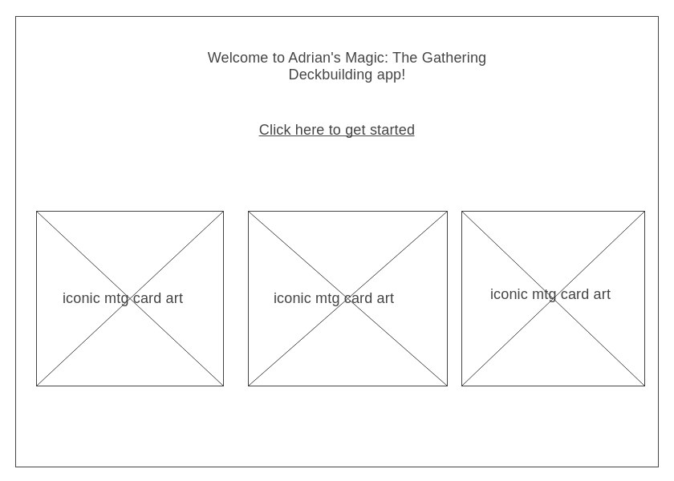

Sign in
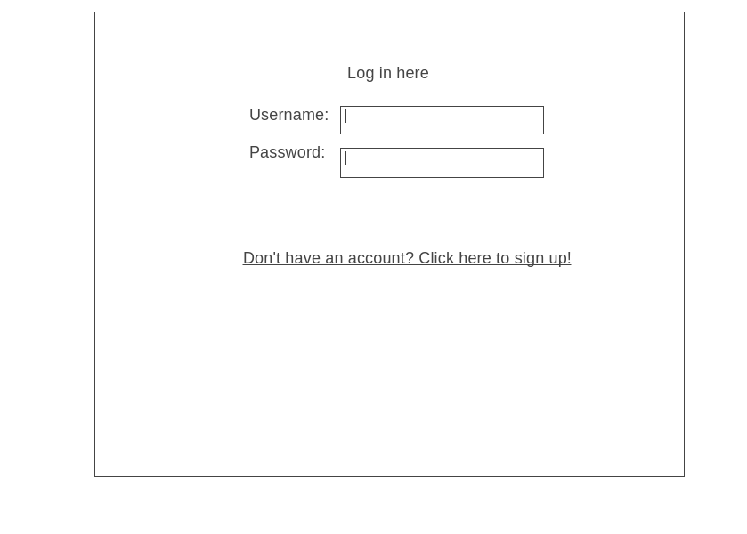

Sign up
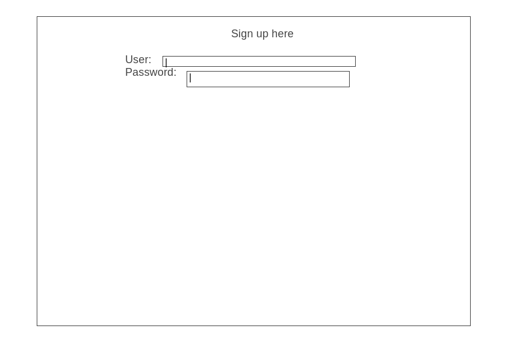

User profile
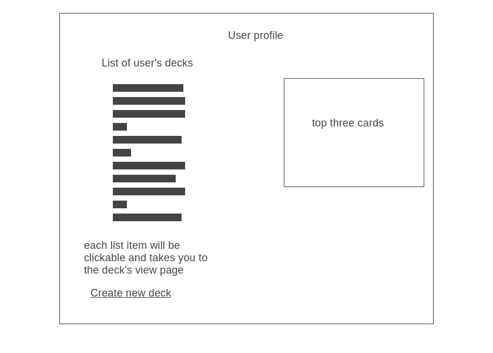

Card view
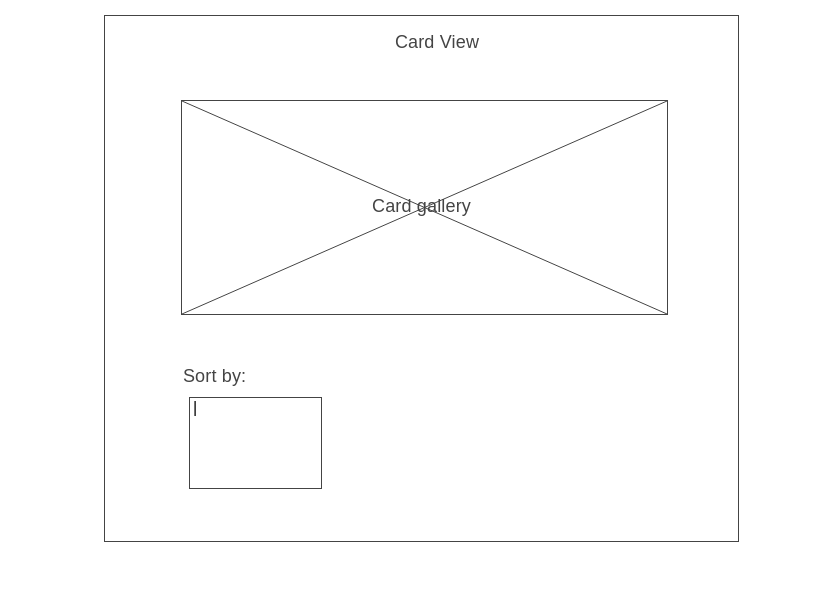

View decks
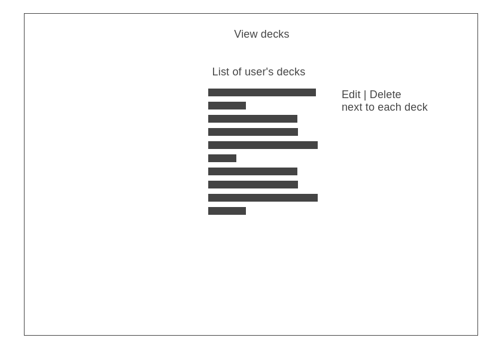

Deck view
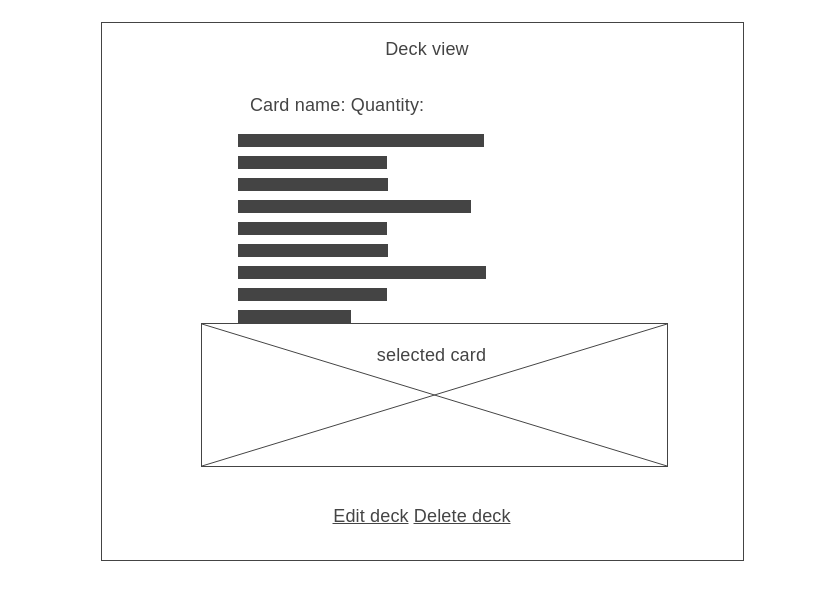

Create deck
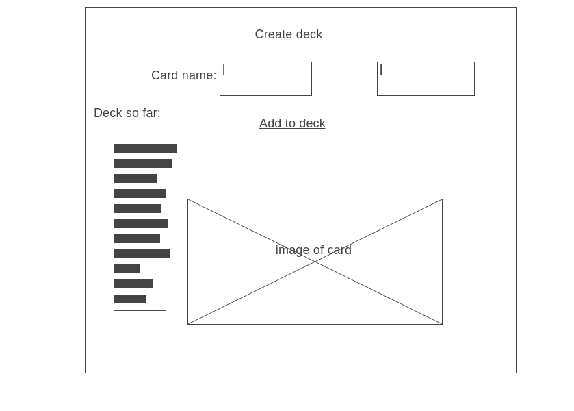

Edit deck
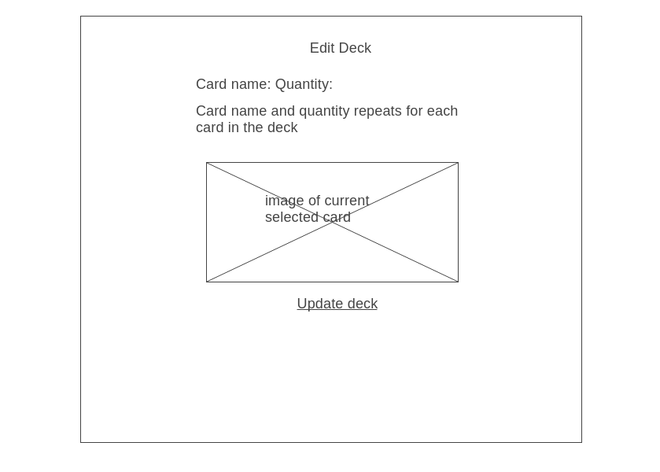

Top 3 cards
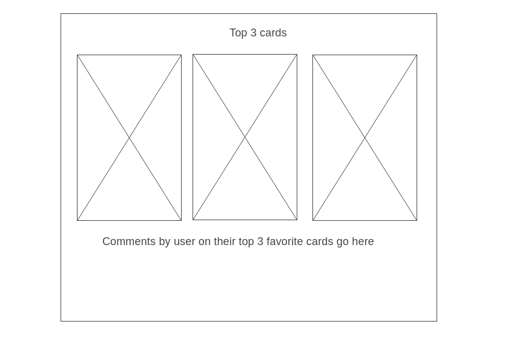

---ERD
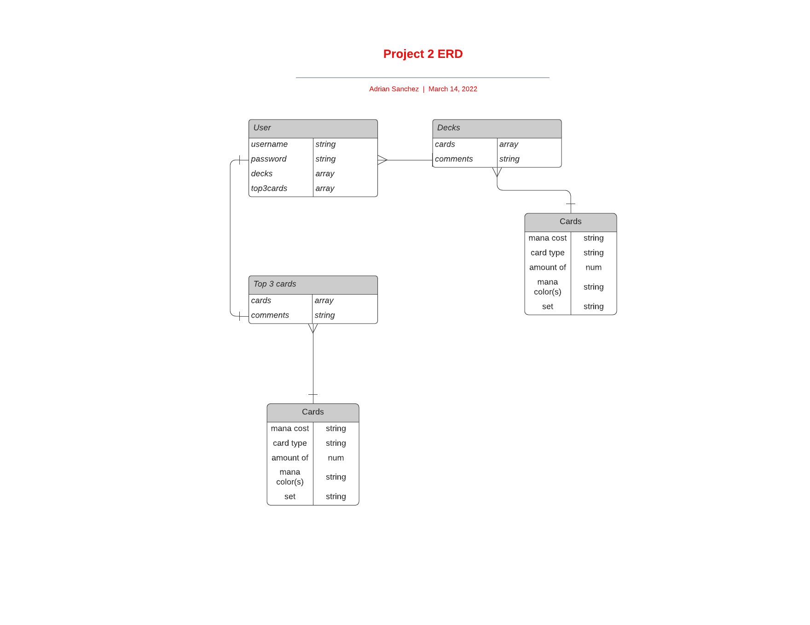