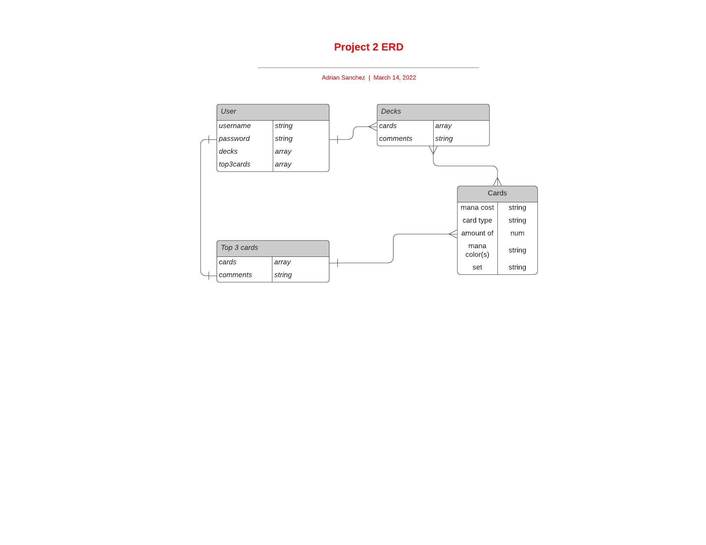

---User Story

As a user, I want to...
-view Magic: The Gathering (MTG) cards in the standard format
-sort cards by normal MTG metrics (mana cost, card type, etc.)
-create decks with standard-legal cards
-edit those decks
-delete decks
-add comments to specific cards in the deck
-have a page displaying my three favorite cards in the standard format
-add comments to decks as a whole

---Wireframes

Home page

Sign in

Sign up

User profile

Card view

View decks

Deck view

Create deck

Edit deck

Top 3 cards

---ERD
